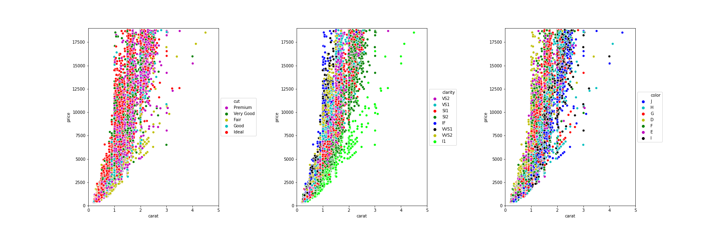

Data Project 2 README file: 
======================

Exploratory Data Visualization Charts and Summary Statistics
---------------------------------------------------------------------------

The goal of the Data Project 2 is to build an exploratory data analysis report to gain insights into a  dataset.

In the csv file diamonds_train there are 40455 datasets describing the characteristics of diamonds.

There are non_numeric characteristics like color, cut and clarity and numeric characteristics like
table, depth, carat, length & width of the diamonds. 

The data analysis was structured into three steps:

1.  Analysis of the data in the columns (numeric data: violineplots, non_numeric data: pie chart)
2.  Analysis of the relationship between  price and  other characteristics of the dataset (correlation matrix, heatmap, scatter  plots, bar plots)
3.  More specific analysis of the gained insights with the analysis of the filtered and binned dataset.

All charts were created via functions with a dataframe as variable.  

**In Tableau public there is an interactive dashboard, where the characteristics of the diamonds can be explored.**

https://public.tableau.com/profile/sina7192#!/vizhome/Diamonds_15960446817820/Dashboard1?publish=yes

Sample Picture of the analysis: Scatter: price vs. carat for the categorical variables

